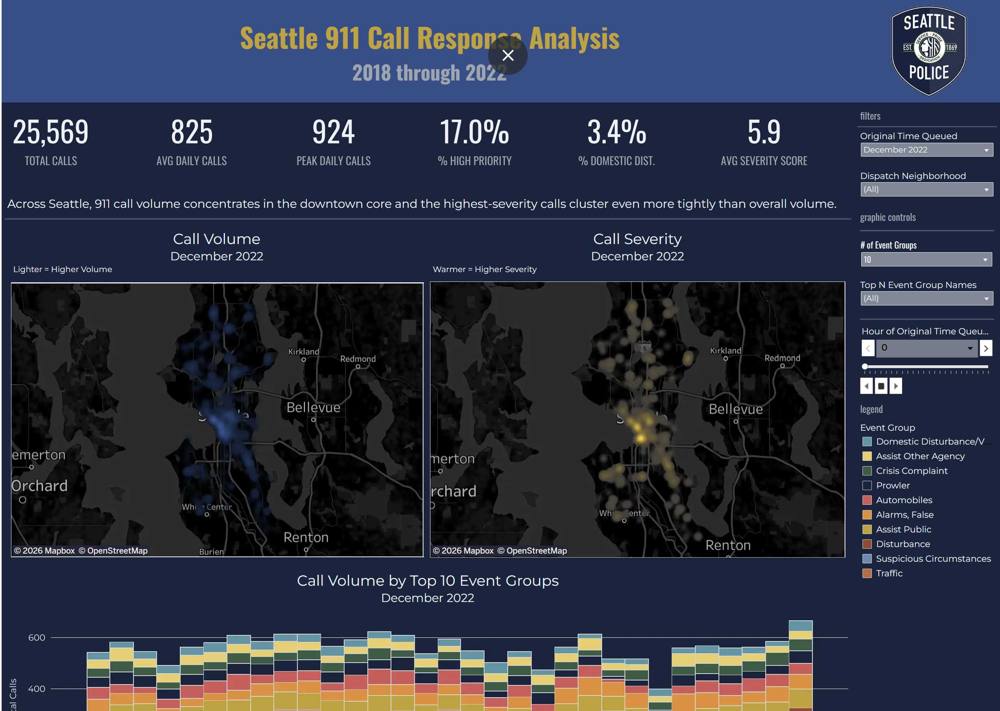

# Seattle 911 Call Response Analysis

**An interactive Tableau dashboard mapping where, when, and how Seattle Police Department 911 call activity concentrates across the city — 2018 through 2022.**

[**▶ View the live dashboard on Tableau Public**](https://public.tableau.com/app/profile/obie.w.lawrence/viz/Seattle911CallResponseAnalysis/SPDCallData)



---

## At a glance

| | |
|---|---|
| **Data** | Seattle Open Data Portal — SPD Call Data |
| **Window** | 2018–2022 |
| **Tool** | Tableau Desktop (full) |
| **Techniques** | Density mapping · LOD calculations · parameter-driven Top-N · Pages-shelf animation · custom palette system |
| **Author** | Obie W. Lawrence |

---

## Overview

Seattle 911 call activity is far from evenly distributed. This dashboard lets a
viewer explore that distribution across space, time, and severity:

- **Volume concentrates heavily in the downtown core** — and the
  **highest-severity calls cluster even more tightly** than overall volume, a
  pattern that only becomes visible when severity is mapped separately from raw count.
- **A live hour-by-hour animation** walks through where calls originate across
  the 24-hour cycle, surfacing the shift in demand from daytime commercial areas
  to late-night nightlife corridors.
- Everything is explorable **by month, neighborhood, and hour of day**, with a
  Top-N selector for isolating the event groups that drive the load.

The goal is an honest operational read on *reported/dispatched demand* — not a
crime-rate map (see [Methodology & limitations](#methodology--limitations)).

---

## The data

- **Source:** [Seattle Open Data Portal](https://data.seattle.gov/) — Seattle
  Police Department *Call Data*.
- **Coverage:** 2018–2022.
- **Grain:** one row per **dispatched unit**, so a single incident can span
  multiple rows. Counts of *incidents* therefore use `COUNTD` of the event key
  rather than a raw row count, to avoid unit-dispatch inflation.
- **Getting the data:** search the [Seattle Open Data Portal](https://data.seattle.gov/)
  for the SPD *Call Data* dataset and export the full CSV (or pull it via the Socrata/SODA
  API). The raw export lives outside this repo; the workbook connects to a local Hyper
  extract built from it. Raw files and extracts are **not committed** — see
  [Repository structure](#repository-structure).

---

## Skills & techniques demonstrated

Built to exercise portfolio-relevant Tableau depth:

- **Density (heatmap) mapping** — a cool-glow volume surface paired with a warm
  severity surface, so concentration and intensity read as two distinct stories.
- **LOD expressions** for normalized daily metrics that stay correct at any level
  of detail the viewer drills to.
- **Parameter-driven Top-N** event-group selector — the reader chooses how many
  categories to surface without touching the underlying view.
- **Pages-shelf animation** — an hour-by-hour player (0–23) that animates call
  origins across the day.
- **Custom dark palette system** — categorical, diverging, and sequential ramps
  designed as a set and stored in `Preferences.tps`.
- **Domain-aware time modeling** — the time-of-day axis is anchored to SPD's
  **3 AM watch change**, not to midnight, so a single shift reads as one
  contiguous block instead of splitting across the axis edge.

---

## Key calculated fields

Two calcs carry the temporal logic:

**`Hour Order (3AM Start)`** — rotates the 24-hour axis so it begins at the 3 AM
watch change, keeping each patrol shift contiguous:

```
([Original Time Queued Hour] - 3 + 24) % 24
```

**`Day of Week`** — day index for the temporal heatmap:

```
DATEPART('weekday', [originalTimeQueued])
```

Incident-level metrics wrap the event key in `COUNTD` because the raw grain is
unit-dispatch rows, not incidents.

---

## Design system

A cohesive dark-canvas theme anchored to SPD's visual identity — navy and
badge gold — calibrated so accents survive the dark tiles rather than receding.

| Role | Hex |
|---|---|
| Canvas | `#0B1829` |
| Sheet background | `#14243F` |
| Primary text | `#EAF1F8` |
| Secondary text / ticks | `#98A6B0` |
| Badge gold accent | `#C8A24B` |

Three custom palettes ship with the workbook (stored in `Preferences.tps`, with
a `.txt` mirror):

- **Seattle Police Department — Call Data** (20-color categorical, anchored in
  SPD navy `#1F4E8C` and badge gold `#C9A227`)
- **Seattle Police Department — Diverging** (11-color)
- **Seattle Police Department — Sequential** (6-color, pale mist `#EAF1F8` →
  deepest navy `#0B1829`)

The three SPD palette blocks are included as `palettes/spd-palettes.tps.xml` so
the color system is reproducible without shipping the entire global preferences file.

---

## Repository structure

```
seattle-911-response/
├── README.md
├── .gitignore
├── tableau/
│   └── Call Data.twb            # Full-Desktop workbook (readable XML). References the
│                                # extract, so it won't render standalone — see below.
├── palettes/
│   └── spd-palettes.tps.xml     # The 3 SPD palette blocks (categorical/diverging/sequential)
├── screenshots/
│   └── dashboard.png            # Static capture of the published dashboard
```

**Deliberately excluded** (extracts and packaged binaries): `*.hyper`, `*.twbx`,
`*.bak`. The rendered, interactive piece lives on Tableau Public — link at the top.

---

## Running it locally

- The workbook is a full **Tableau Desktop `.twb`** — human-readable XML, so the
  LOD calcs, Top-N parameter, and calculated fields are all inspectable in the file.
- Because it connects to a local extract that isn't committed, **`Call Data.twb`
  will not render on its own after cloning.** For the live, interactive dashboard,
  use the Tableau Public link above.
- To rebuild the data source from scratch, pull the SPD *Call Data* export from the
  [Seattle Open Data Portal](https://data.seattle.gov/) (see [The data](#the-data)),
  point the workbook's connection at your local copy, and create an extract.

---

## Methodology & limitations

Disclosed in the same spirit as the on-dashboard footnote:

- **Reported/dispatched activity, not crime incidence.** Call volume reflects
  what was reported and dispatched — it is *not* a measure of crime rates, arrests,
  or verified offenses.
- **Records without coordinates are excluded from the maps.** Calls missing
  latitude/longitude are dropped from spatial views (but remain in non-spatial counts).
- **Unit-dispatch grain.** The source records one row per dispatched unit;
  incident counts use `COUNTD` of the event key to avoid inflation.
- **The 3 AM axis origin is a deliberate analytical choice**, aligning the
  time-of-day view with SPD shift structure rather than the calendar day.
- Any intentional visual compromises (truncated axes, color-scale caps) are
  disclosed on the dashboard itself.

---

## Author & license

**Obie W. Lawrence**
[Tableau Public](https://public.tableau.com/app/profile/obie.w.lawrence) ·
[GitHub](https://github.com/obi-law)

Source data is published by the City of Seattle via the
[Seattle Open Data Portal](https://data.seattle.gov/) under its open data terms.
Workbook, palettes, and documentation in this repository are the author's own work.